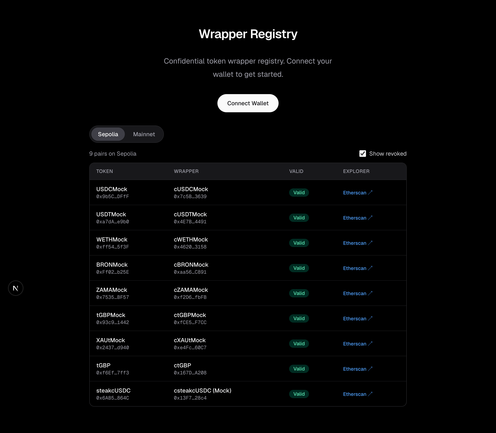
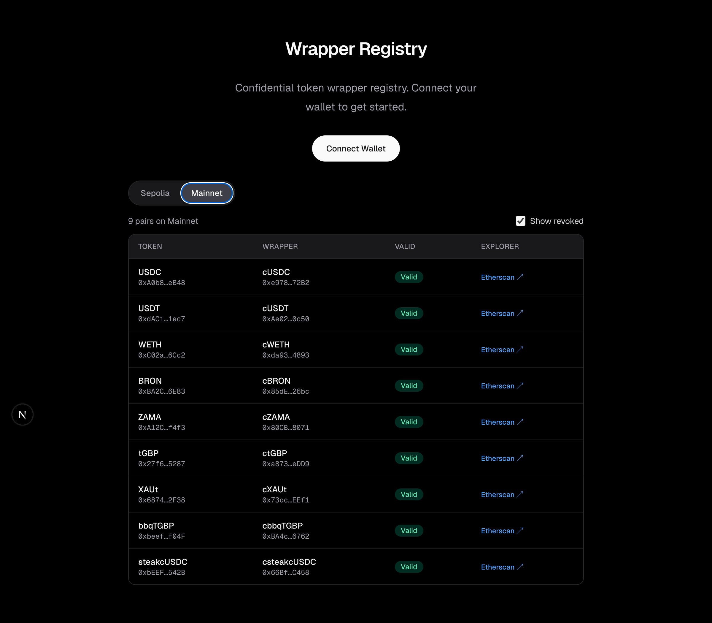
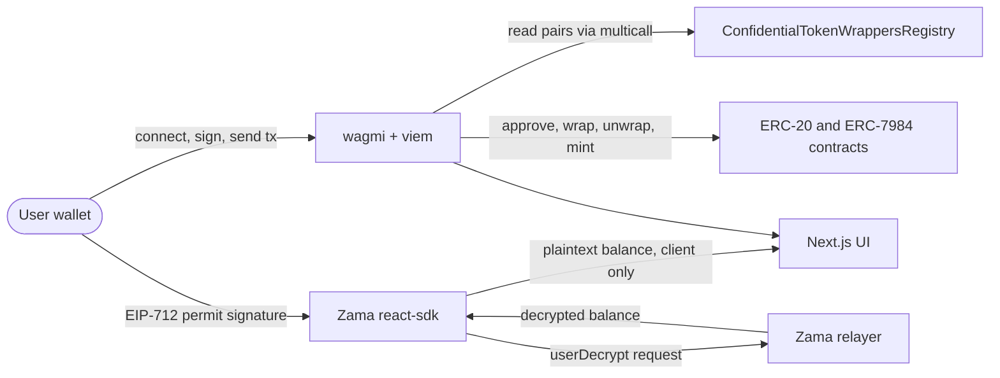
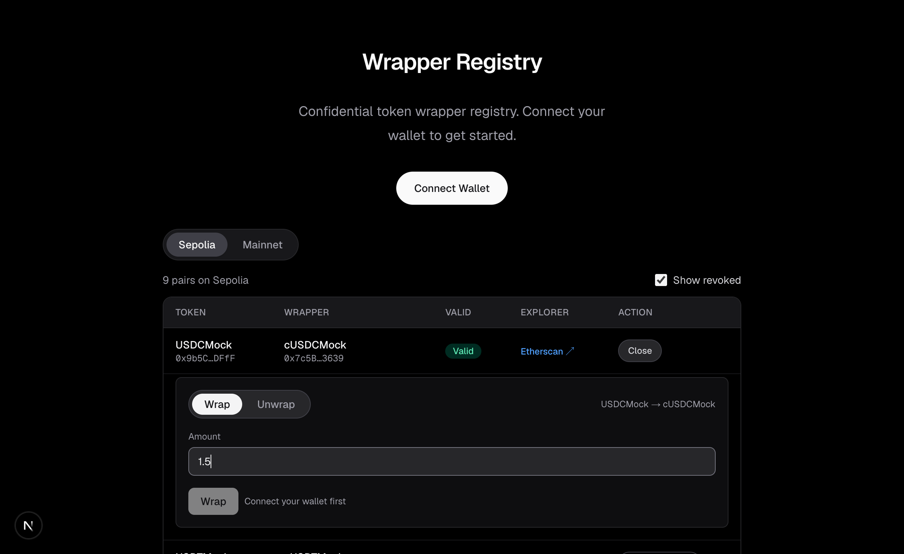
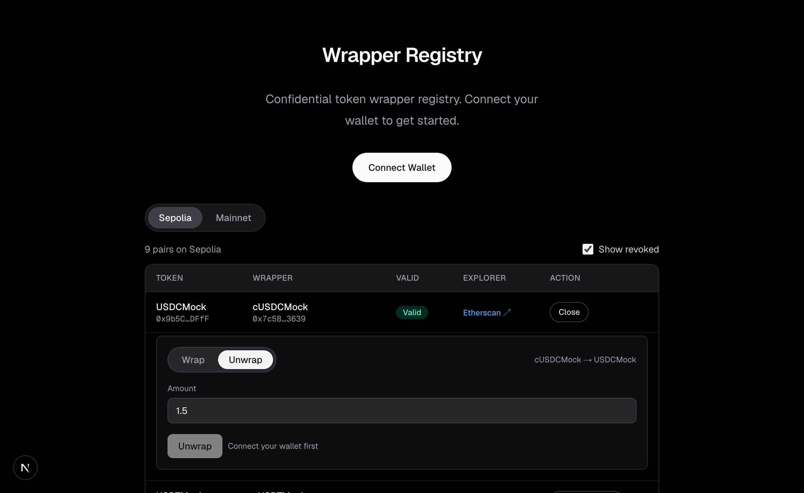
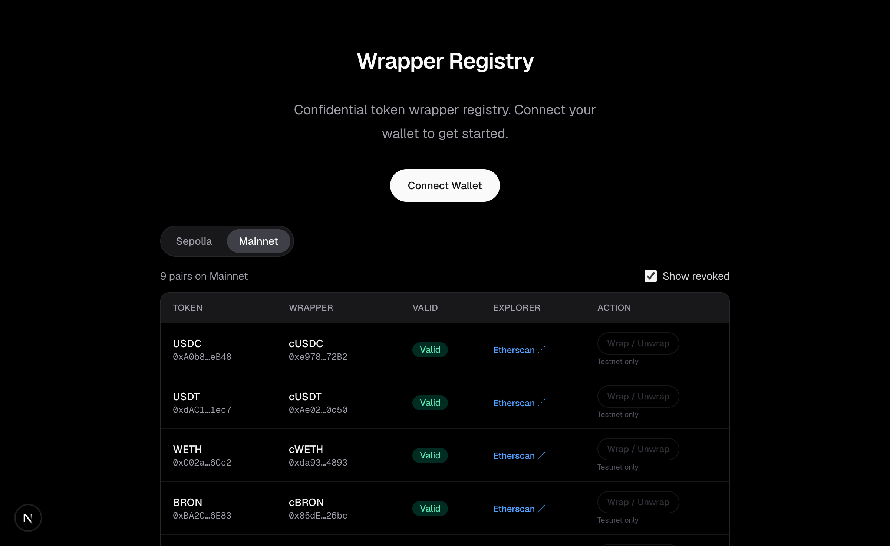
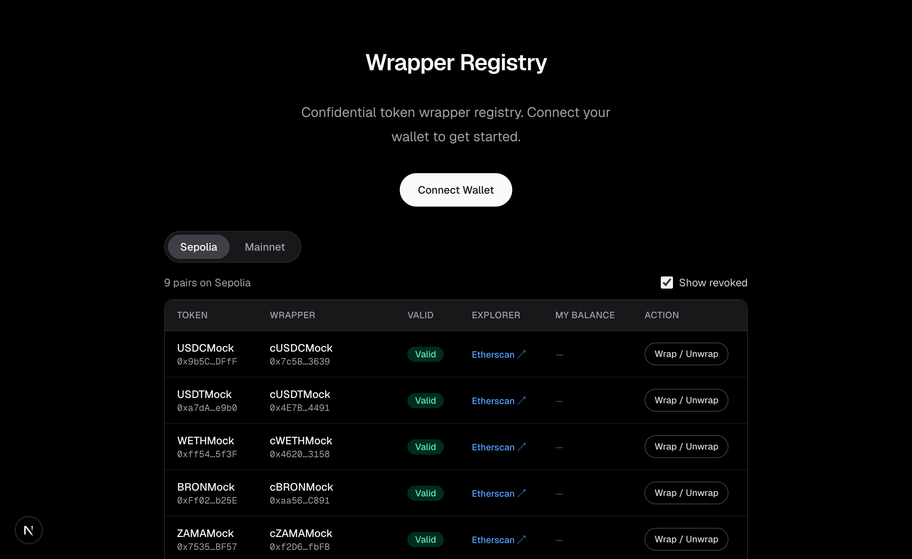
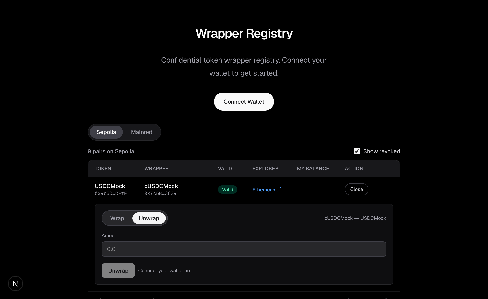
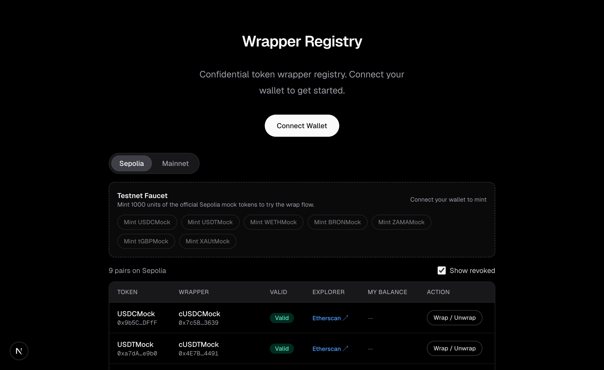
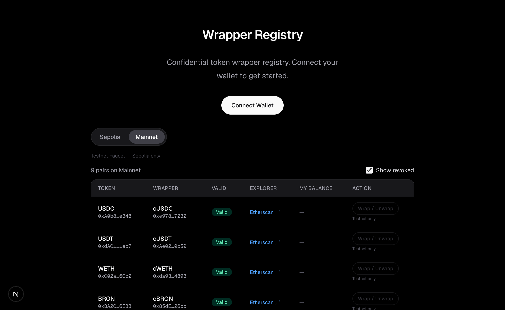

# Confidential Wrapper Registry

A Next.js app for browsing the Zama Confidential Token Wrappers Registry and interacting with ERC-20 to ERC-7984 wrapper pairs: wrap, unwrap, and decrypt confidential balances.

Built for the Zama Developer Program Season 3 Bounty Track.

## What it does

1. Lists every registered ERC-20 to ERC-7984 wrapper pair on Sepolia and Ethereum mainnet, read directly from the on-chain registry contract, including revoked pairs.
2. Wraps and unwraps any listed pair on Sepolia (mainnet is read-only), with per-transaction status steps and explorer links.
3. Decrypts your confidential ERC-7984 balance client side using an EIP-712 user-decryption permit. Only your wallet can read your balance.
4. Provides a Sepolia faucet that mints the official Zama mock underlying tokens (USDCMock, USDTMock, WETHMock, and others) so the wrap flow can be tried without holding any tokens.

Registry on Sepolia:



Registry on mainnet (read-only, write actions disabled):



## Architecture



The app has no backend. All reads go through public RPC endpoints, all writes go through the connected wallet, and decryption goes through the Zama relayer configured per chain in `app/providers.tsx`.

### Project structure

```text
app/
  layout.tsx          Root layout, restores wagmi state from cookies for SSR
  page.tsx            Home page composing ConnectWallet and RegistryExplorer
  providers.tsx       WagmiProvider, QueryClientProvider, ZamaProvider with per-chain relayers
  config.ts           wagmi config: Sepolia + mainnet, injected connector, cookie storage
  connect-wallet.tsx  Connect and disconnect button with the injected connector
components/
  RegistryExplorer.tsx  Network tabs (Sepolia, Mainnet), mounts Faucet and RegistryTable
  RegistryTable.tsx     Pair table with revoked filter, skeletons, and expandable rows
  WrapPanel.tsx         Wrap and unwrap form with approval detection and tx step list
  DecryptBalance.tsx    Permit grant plus on-demand confidential balance decryption
  Faucet.tsx            Mint buttons for the official Sepolia mock underlying tokens
lib/
  registry.ts           Registry ABI, chain config, slice pagination, metadata multicall
  format.ts             Address shortening helper
```

## How it works

### Wrap and unwrap

The wrap form checks the current ERC-20 allowance toward the wrapper with `useUnderlyingAllowance`. When the entered amount exceeds the allowance, `useShield` first submits an approve transaction, then the wrap transaction, and reports both hashes through callbacks that the UI renders as a step list. Unwrap uses `useUnshield`, which submits the unwrap, waits for the decryption proof, and then submits the finalize transaction. Before unwrapping, the panel verifies the user has a decryption permit, since the SDK reads the confidential balance to validate the amount.





On mainnet the same panels render but stay disabled, so pairs can be inspected without any risk of sending a transaction:



### Balance decryption

ERC-7984 balances are stored as ciphertext handles, so a plain `balanceOf` returns nothing readable. The user first signs a gas-free EIP-712 permit with `useGrantPermit`; nothing is sent on chain. `useHasPermit` gates the UI so the permit is only requested once per wrapper contract. After that, clicking Decrypt runs `useConfidentialBalance`, which sends a userDecrypt request to the Zama relayer and returns the plaintext amount to the browser only. The decrypted value never leaves the client.





### Registry reading

`lib/registry.ts` reads `getTokenConfidentialTokenPairsLength` and then pages through `getTokenConfidentialTokenPairsSlice` in batches of 50, so the app keeps working as the registry grows. Token name, symbol, and decimals for both sides of every pair are fetched in a single viem multicall with `allowFailure: true`, so one broken token contract cannot break the whole table. Results are cached for 60 seconds with TanStack Query.

## Zama SDK hooks used

| Hook | Purpose |
| --- | --- |
| `useShield` | Wraps ERC-20 into ERC-7984, submitting the approve transaction first when the allowance is insufficient |
| `useUnshield` | Unwraps ERC-7984 back to ERC-20, including the decryption proof wait and the finalize transaction |
| `useGrantPermit` | Signs the gas-free EIP-712 user-decryption permit for a wrapper contract |
| `useHasPermit` | Checks whether a valid permit already exists, used to gate decrypt and unwrap UI |
| `useConfidentialBalance` | Decrypts the caller's own ERC-7984 balance through the relayer |
| `useUnderlyingAllowance` | Reads the ERC-20 allowance granted to the wrapper, used for approval detection |

## Setup

Requirements: Node.js 18 or newer, a browser wallet such as MetaMask, and some Sepolia ETH for gas.

```bash
git clone <repo-url>
cd wrapper-registry
npm install
npm run dev
```

Open http://localhost:3000. No environment variables are needed; the app uses public RPC endpoints and the public Zama relayer.

## Usage

1. Connect your wallet and make sure it is on Sepolia. The app offers a switch button when it is not.
2. Mint test tokens from the Testnet Faucet, for example 1000 USDCMock. The faucet only appears on the Sepolia tab.
3. Expand a pair row and wrap an amount. If an approval is needed, the flow submits the approve transaction first, then the wrap.
4. Click Enable decryption once per wrapper and sign the EIP-712 permit, then click Decrypt balance to see your confidential balance.
5. Switch the panel to unwrap and convert the confidential tokens back to the plain ERC-20.



The faucet is hidden on mainnet:



## Registry contract addresses

| Network | Address |
| --- | --- |
| Sepolia | `0x2f0750Bbb0A246059d80e94c454586a7F27a128e` |
| Ethereum mainnet | `0xeb5015fF021DB115aCe010f23F55C2591059bBA0` |

Source: [Zama protocol addresses](https://docs.zama.org/protocol/protocol-apps/addresses). They match the `registryAddress` constants shipped in `@zama-fhe/sdk/chains`.

## Tech stack

- Next.js 15 (App Router) with TypeScript
- wagmi v3 and viem for wallet connection and contract reads and writes
- @zama-fhe/sdk and @zama-fhe/react-sdk for wrapping, permits, and user decryption
- TanStack Query for caching and request state
- Tailwind CSS 4 for styling

## License

MIT
